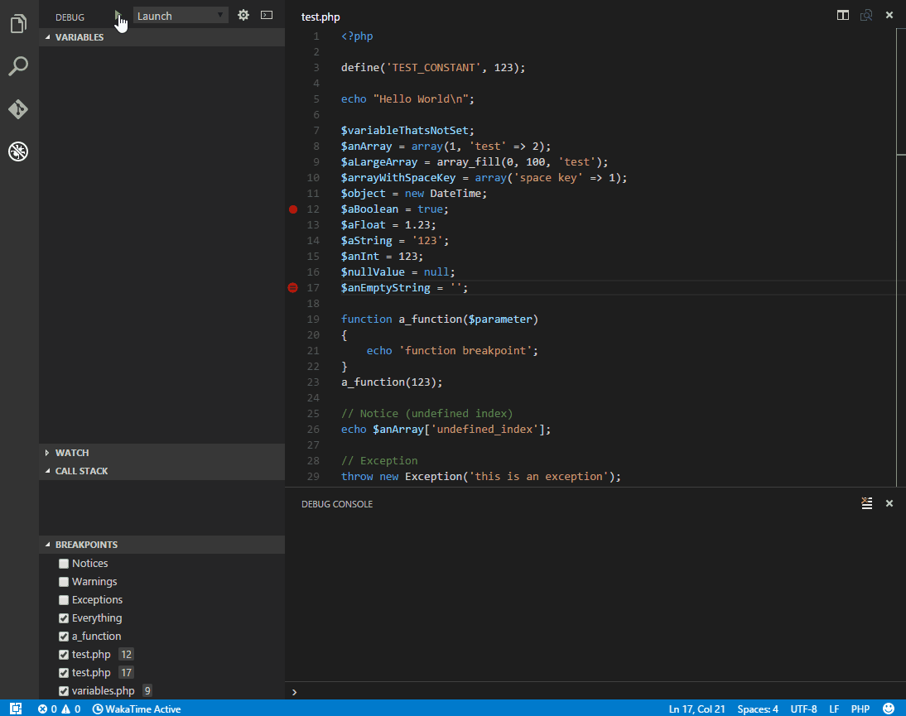

# IDEをどこまで<br>使いこなすべきか（哲学） <!-- .element: style="font-size: 120px;" -->


---

## 話すこと

<div>

- 自己紹介代わりに今まで触れたIDEの印象
- IDEにこだわる理由
- 自分ならIDEの環境構築ここまでやるというライン
  - それぞれの人のこだわりもありそうなので<br>逆に聞いてみたいやつ
  - 独自で考えたLintルール追加

</div>

---

## 話さないこと

- 開発環境として使用したことがないエディターの話
  - Vim、TeraPad、Sublime、Atomも使ったことはあるがテキストエディターとしての利用だったので
- 自己紹介以降はVSCodeではないIDEの話をしないようにします
- Lintツールのコード詳細
  - 過去にブログ書いてたので後のページにリンク記載します

---

## 自己紹介

---

<div style="text-align: left;">
五十嵐 翔
</div>

<div class="r-hstack">
  <div style="width: 100%;">
使用経験のある<br>IDE
  </div>
  <div style="width: 100%;">
    <br>
  </div>
</div>

<div class="r-hstack">
  <div style="width: 100%; margin-top: 0; margin-bottom: auto;">

- Eclipse <!-- .element: class="fragment highlight-red" data-fragment-index="1" -->
- Android Studio
- Xcode
- VSCode

  </div>
  <div style="width: 100%; margin-top: 0; margin-bottom: auto;">
    <div class="fragment fade-in-then-out" data-fragment-index="1" style="font-size: 32px;">

JavaのSeasar少しやったり<br>
PHP SDK入ったEclipseで<br>
Zend、Cakeいじったり<br>
Android SDK入ったEclipseで<br>
Android開発やってたり<br>
VSCodeが出るまでPHPは<br>
Eclipseで開発してた
    </div>
  </div>
</div>

---

<div style="text-align: left;">
五十嵐 翔
</div>

<div class="r-hstack">
  <div style="width: 100%;">
使用経験のある<br>IDE
  </div>
  <div style="width: 100%;">
    <br>
  </div>
</div>

<div class="r-hstack">
  <div style="width: 100%; margin-top: 0; margin-bottom: auto;">

- Eclipse
- Android Studio <!-- .element: class="fragment highlight-red" data-fragment-index="1" -->
- Xcode
- VSCode

  </div>
  <div style="width: 100%; margin-top: 0; margin-bottom: auto;">
    <div class="fragment fade-in-then-out" data-fragment-index="1" style="font-size: 32px;">

EclipseのAndroid SDKが<br>
サポート切れるので乗り換え<br>
初めて使用したIntelliJ<br>
だった<br>
ファイル検索が速くて<br>
快適だった印象
    </div>
  </div>
</div>

---

<div style="text-align: left;">
五十嵐 翔
</div>

<div class="r-hstack">
  <div style="width: 100%;">
使用経験のある<br>IDE
  </div>
  <div style="width: 100%;">
    <br>
  </div>
</div>

<div class="r-hstack">
  <div style="width: 100%; margin-top: 0; margin-bottom: auto;">

- Eclipse
- Android Studio
- Xcode <!-- .element: class="fragment highlight-red" data-fragment-index="1" -->
- VSCode

  </div>
  <div style="width: 100%; margin-top: 0; margin-bottom: auto;">
    <div class="fragment fade-in-then-out" data-fragment-index="1" style="font-size: 32px;">

iOSアプリで使用<br>
当時はSwift UIもなく<br>
（Objective-Cありましたね）<br>
Interface Builder上や<br>
コード上でのUI生成など<br>
やってて辛かった<br>
Apple公式の開発環境なので<br>
昔から完成度高い印象はあった<br>
    </div>
  </div>
</div>

---


<div style="text-align: left;">
五十嵐 翔
</div>

<div class="r-hstack">
  <div style="width: 100%;">
使用経験のある<br>IDE
  </div>
  <div style="width: 100%;">
    <br>
  </div>
</div>

<div class="r-hstack">
  <div style="width: 100%; margin-top: 0; margin-bottom: auto;">

- Eclipse
- Android Studio
- Xcode
- VSCode <!-- .element: class="fragment highlight-red" data-fragment-index="1" -->

  </div>
  <div style="width: 100%; margin-top: 0; margin-bottom: auto;">
    <div class="fragment fade-in-then-out" data-fragment-index="1" style="font-size: 32px;">

拡張が多いので<br>
大抵の環境は補えている<br>
たまに新しい開発環境や<br>
古いCake、Railsの<br>
HTMLテンプレートとか<br>
辛み<br>
待望論で誰か拡張作って
    </div>
  </div>
</div>

---

## IDEにこだわる理由

---

理由

<div style="font-size: 32px;">

- 多くあるコードを適切に速く読み解くため
  - とにかくコードジャンプとファイル検索しまくれる
- 質の良いコードを生成するきっかけになるため
  - 型言語プログラミングとかは null|undefined などの曖昧な型がなくなるようになる仕組み
- 人的なコードレビューは見落としが発生する場合があるため
  - コーディングしながら静的解析が入って過ちに気付けるものが望ましい
- IDEの違いは人によって若干異なるが一定の作業感で仕事が進められることを確証するツールとしてIDEが在り続けてほしいという願望

</div>

<div class="fragment" style="color: red;">

すべては効率化のため

</div>

<div class="fragment" style="color: blue;">

IDEがないとコーディングできる自信がありません

</div>

---

## 自分ならIDEの環境構築ここまでやる

---

<div style="font-size: 28px; padding-top: 32px;">

- ただのテキスト同然の状態
- --------- どうしようもないライン --------- <!-- .element: style="color: orange;" -->
- シンタックスハイライト・構文強調
- コードジャンプ
- インテリセンス・入力補完
- スタックトレースもあるようなブレークポイントのデバッグ機能
- --------- なんとかコーディングできるライン --------- <!-- .element: style="color: blue;" -->
- 共通で使用するVSCodeの設定共有
- LintツールとVSCodeを連携
- 独自で考えたLintルール追加
- ---------- 超えられない壁 ---------- <!-- .element: style="color: red;" -->
- Language Server開発
- VSCode拡張作成
  - これできたら数あるHTMLテンプレートの取り扱いに困ってない

様子見で途中話を省略しようかなと思います

</div>

<div style="font-size: 28px; padding-top: 12px;">
上記、順番決めるの難しかったのでナンバリングせず箇条書きですみません
</div>

---

### ただのテキスト同然の状態 とは

---

CSVの拡張を入れてないときのCSVファイルの見にくい件や


このCSVを表確認するためだけにExcelなどを<br>開くのも躊躇うときがある

---

元のファイルとは異なる構文のものがある例としてJavaScriptの文字列としてHTMLがある場合


---

### シンタックスハイライト<br>・<br>構文強調 とは

---

<a href="https://marketplace.visualstudio.com/items?itemName=mechatroner.rainbow-csv" style="text-decoration: underline;">Rainbow CSV</a>を入れれば<br>色がつき識別がしやすくなる


---

before


---

<a href="https://marketplace.visualstudio.com/items?itemName=Tobermory.es6-string-html" style="text-decoration: underline;">es6-string-html</a>を入れることでHTMLの<br>閉じの識別がしやすくなる


---

before


---

### コードジャンプ とは

---

OSによって[Command か Ctrl] + マウス右クリックで変数の宣言元を表示できる機能

<video controls src="./assets/code_jump.webm">

---

### インテリセンス・入力補完 とは

---

弊社の事例になるが<a href="https://phpstan.org" style="text-decoration: underline;">PHPStan</a>導入し、<br>PHPDocとassert構文を組み合わせて<br>入力補完を強めたりしている


---

before


---

### スタックトレースもあるような<br>ブレークポイントの<br>デバッグ機能 とは

---

<a href="https://marketplace.visualstudio.com/items?itemName=xdebug.php-debug" style="text-decoration: underline;">PHP Debug</a>によるPHPデバッグ

調べればやり方はいっぱい出てくるので<br>Gifを見せて説明省略



---

### 共通で使用する<br>VSCodeの設定共有 とは

---

.vscode/settings.json

VSCodeの設定を共有するファイル

```
{
  // 特殊文字・制御文字を見えるようにする
  "editor.renderControlCharacters": true,

  // 最終行は改行入れる POSIX準拠で入れてる
  "files.insertFinalNewline": true,

  // OSの違いで異なる改行コードを入力されても困るので
  "files.eol": "\n",
  ...
}
```

その他、Lint(ESLint、Stylelintなど)の設定を<br>プロジェクト毎で設定している

---

.vscode/extensions.json

使用するVSCodeの拡張をまとめている

```
{
  // See http://go.microsoft.com/fwlink/?LinkId=827846
  // for the documentation about the extensions.json format
  "recommendations": [
    // Extension identifier format: ${publisher}.${name}. Example: vscode.csharp
    "dbaeumer.vscode-eslint",
    "stylelint.vscode-stylelint",
    "stuartzhang.stylelint-stzhang",
    "esbenp.prettier-vscode",
    "styled-components.vscode-styled-components",
    "ijs.emotionsnippets",
    "xdebug.php-debug",
    "bmewburn.vscode-intelephense-client",
    "mrmlnc.vscode-scss",
    "taichi.vscode-textlint",
    "vunguyentuan.vscode-css-variables"
  ]
}
```

---

.vscode/launch.json

PHPのデバッグの設定も共有している

```
{
    // Use IntelliSense to learn about possible attributes.
    // Hover to view descriptions of existing attributes.
    // For more information, visit: https://go.microsoft.com/fwlink/?linkid=830387
    "version": "0.2.0",
    "configurations": [
        {
            "name": "Listen for XDebug",
            "type": "php",
            "request": "launch",
            "port": 9000,
            "stopOnEntry": false,
            "pathMappings": {
                "/var/www/": "${workspaceRoot}"
            }
        }
    ]
}

```

---

### LintツールとVSCodeを連携 とは

---

Stylelint
- stylelint-config-recess-order
  - 記載したStyle要素の順番をソートする
- stylelint-config-prettier
  - 保存時にprettierを用いて改行やコードブロックのインデントをフォーマットする

---

ESLint
- jsx-a11y
  - アクセビリティに準じたHTMLが記載できているかチェックするツール
- simple-import-sort
  - 記載したimport文のソートをする

---

### 独自で考えたLintルール追加 とは

---

#### Stylelint編

---

定義済の色の変数がある場合は書き直すように警告

色以外にも間隔(margin, padding)や透過(opacity)の指定にも同様なルール追加


---

定義にない値を読み込もうとしたときも警告される


---

#### ESLint編

---

CSS in JS上でも独自のStylelintルールを適応している


---

#### textlint編

---

表記揺れのような文言チェックツールを入れて<br>違反していたら警告されるようにした


---

#### 独自で考えたLintルール追加した際のブログ

---

Stylelint


<a href="https://zenn.dev/igara/articles/custom_stylelint" style="text-decoration: underline;">独自のStylelint拡張をかいた<br>補足 共通のカラーコード参照</a>

---

ESLint


<a href="https://zenn.dev/igara/articles/add_custom_stylelint_eslint" style="text-decoration: underline;">ESLintのルール新規追加、<br>Stylelintのルール追加しました 補足</a>

---

textlint


<a href="https://marketplace.visualstudio.com/items?itemName=xdebug.php-debug" style="text-decoration: underline;">Spreadsheet管理のライティングルールを<br>textlintで浸透させる VSCodeにも適応する</a>

---

## まとめ

- 話したいことは独自のLintの話だったがそもそもIDEとどう向き合っていたのかというのを初めて言語化できました
- 例で少しのパターンや時間上、話しきれなかったところが多いので再度こちらの資料を目を通して懇親会で会話出来ればと思います
- 余談ですが今回のスライド作成で使用した<a href="https://revealjs.com" style="text-decoration: underline;">revealjs</a>がなかなか便利だったので後日ブログにあげたいと思います

---

完
